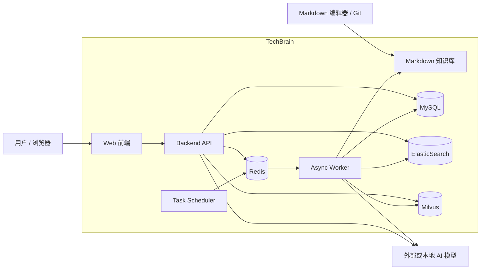
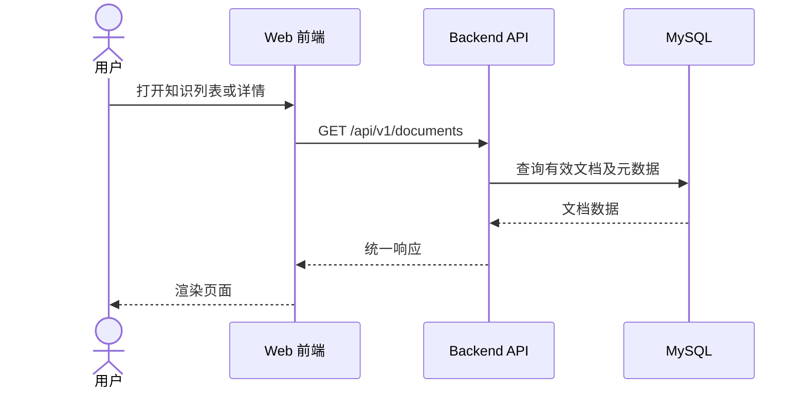
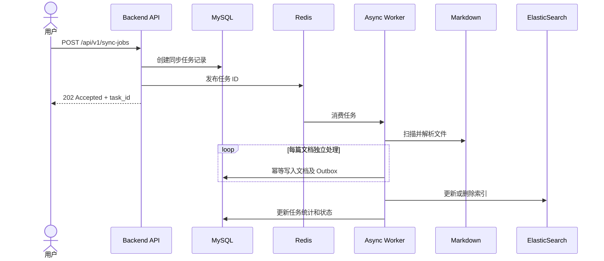
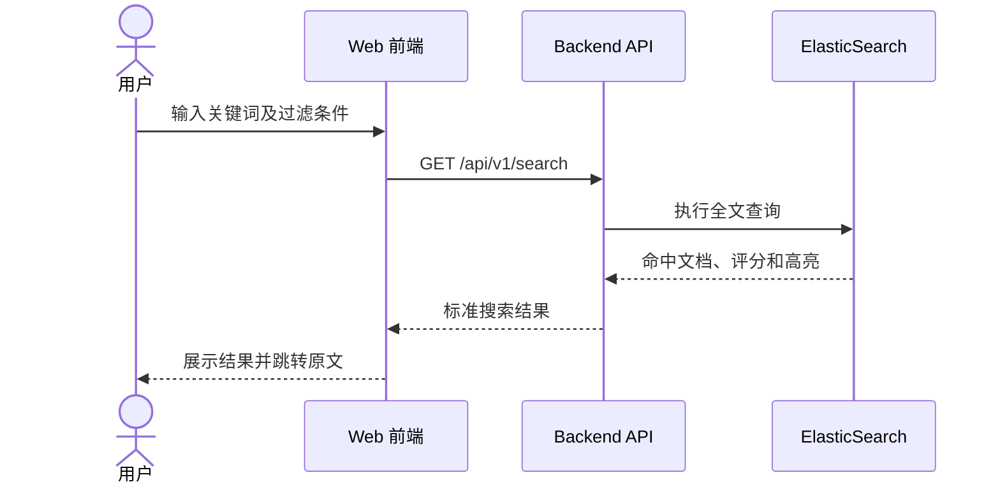
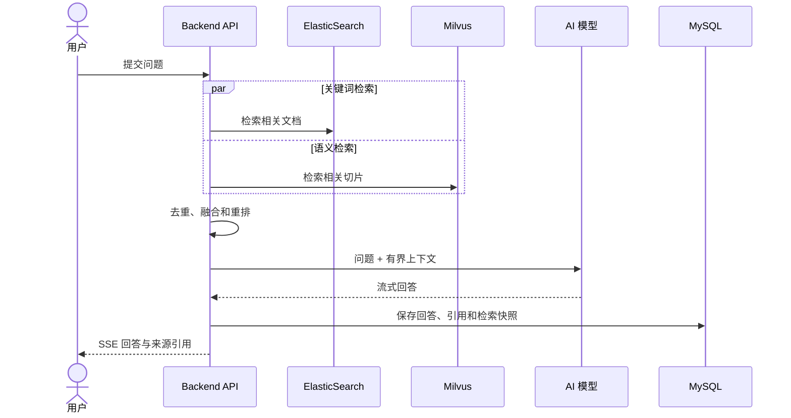
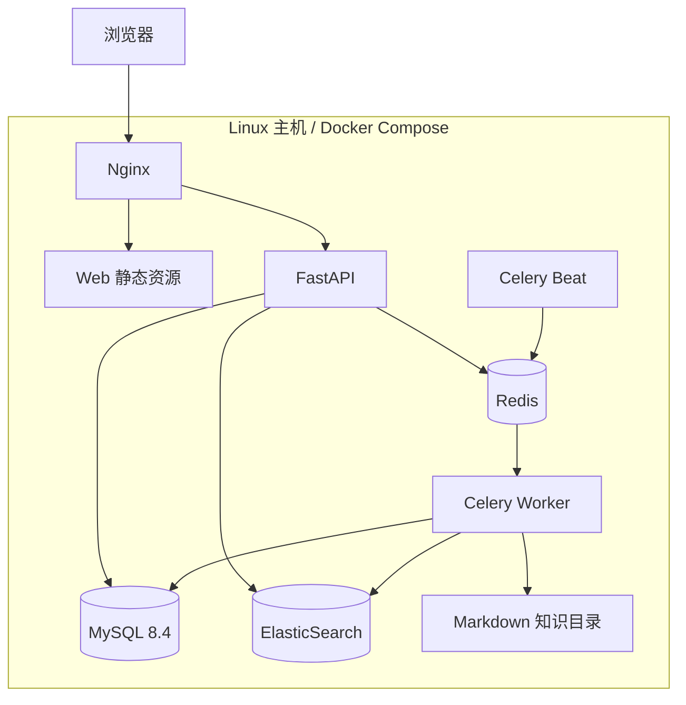

# TechBrain 系统架构设计

> 需求编号：TB-V01-001  
> 文档状态：已确认  
> 决策日期：2026-06-23  
> 适用范围：V0.1 至 V4.0  
> 关联文档：[技术选型记录](technology-decisions.md)

## 1. 架构目标

TechBrain 的系统架构需要同时满足以下目标：

- Markdown 始终是知识内容和知识元数据的唯一事实来源。
- MySQL、ElasticSearch 和 Milvus 均为可以重建的派生存储。
- V1.0 能够以较低运维成本完成个人部署。
- 同步、全文检索、向量化和 AI 任务可以异步执行、失败重试和独立扩缩。
- 后续版本可以增加 RAG、知识图谱和 Agent，而不推翻 V1.0 的核心结构。
- 单个外部组件故障时，原始 Markdown 知识仍然安全可读。
- 避免在产品早期引入微服务、Kubernetes 和分布式事务等不必要复杂度。

## 2. 核心架构决策

TechBrain 采用：

> 前后端分离的模块化单体应用，加独立异步任务进程和多种派生存储。

后端 API、同步逻辑、搜索逻辑和 AI 编排位于同一个后端代码库，通过清晰的模块边界隔离；运行时将在线 API、异步 Worker 和定时调度器部署为不同进程。

这一结构不是传统的“所有逻辑堆在一个进程中”，也不是微服务。它保留单代码库、单业务数据库和本地事务的开发效率，同时允许耗时任务脱离 HTTP 请求独立运行。

## 3. 系统上下文



### 3.1 外部参与者

| 参与者 | 与系统的关系 |
| --- | --- |
| 用户 | 浏览知识、搜索、收藏、发起同步和使用 AI 能力 |
| Markdown 编辑器 | 在系统外直接编辑唯一知识源 |
| Git | 对 Markdown 知识库进行版本控制、备份和迁移 |
| AI 模型服务 | V2.0 起提供 Embedding、LLM 或重排能力 |

## 4. 逻辑组件

### 4.1 Web 前端

职责：

- 提供知识首页、分类、标签、文档详情和搜索界面。
- 发起同步任务并展示任务状态。
- V2.0 起提供问答、引用和流式响应界面。
- V3.0 起提供知识图谱交互。
- V4.0 起提供学习路线和 Agent 工作台。

边界：

- 只通过 Backend API 访问业务数据。
- 不直接访问 MySQL、ElasticSearch、Milvus 或 Markdown 文件系统。
- 不保存业务事实，仅保存必要的本地界面状态。

### 4.2 Backend API

职责：

- 提供版本化 REST API 和 OpenAPI 文档。
- 处理参数校验、业务编排、权限边界和统一错误响应。
- 查询 MySQL、ElasticSearch 和 Milvus。
- 创建异步任务并返回任务标识。
- V2.0 起通过 SSE 输出 AI 流式回答。

边界：

- 在线请求中不执行全库扫描、批量索引或大规模向量化。
- 不把 Redis 当作业务事实数据库。
- 不直接在控制器中实现存储细节，通过应用服务和仓储接口访问外部组件。

### 4.3 Knowledge Sync 模块

Knowledge Sync 是后端中的核心业务模块，由异步 Worker 执行。

职责：

- 扫描配置的 Markdown 知识目录。
- 解析 Front Matter 和 Markdown 结构。
- 校验知识规范。
- 通过文档 ID、规范化路径和内容哈希识别新增、修改、移动和删除。
- 将解析结果幂等写入 MySQL。
- 产生搜索索引、向量索引等后续处理事件。
- 记录任务和单文档处理结果。

边界：

- Markdown 是同步输入的权威来源。
- 一篇文档处理失败不能回滚或阻塞其他文档。
- 对源文件的任何平台内写操作必须走专门的安全写回流程，不允许直接修改后再补数据库。

### 4.4 Async Worker

职责：

- 执行全量和增量知识同步。
- 写入、删除和重建 ElasticSearch 索引。
- V2.0 起执行切片、Embedding 和 Milvus 索引任务。
- 执行耗时的 AI 总结、图谱建议和学习任务。
- 按任务策略进行超时、重试和失败记录。

边界：

- 每项任务必须具备幂等键。
- 任务消息只传递资源标识和必要参数，不传递完整知识正文。
- 业务结果写入 MySQL；Redis 中的消息和结果不可作为唯一记录。

### 4.5 Task Scheduler

职责：

- 按配置周期创建知识同步、索引检查和清理任务。
- V4.0 起触发经用户授权的周期性学习任务。

边界：

- 同一部署环境只运行一个有效调度器实例。
- 调度器只负责发布任务，不执行具体业务逻辑。
- 远期任务计划持久化在 MySQL，不依赖 Redis 长时间保存 ETA 消息。

### 4.6 MySQL

职责：

- 保存文档结构化记录、分类、标签和关系。
- 保存同步任务、失败记录、幂等记录和 Outbox 事件。
- 保存收藏、问答历史、引用快照和用户配置等不可从 Markdown 重建的数据。

边界：

- 文档正文和知识元数据仍以 Markdown 为权威。
- 文档派生表可以从 Markdown 重建。
- 用户行为和历史数据必须单独备份，不能假设可从 Markdown 恢复。

### 4.7 ElasticSearch

职责：

- 索引标题、正文、代码块、分类和标签。
- 提供关键词检索、过滤、相关度排序和高亮。
- V2.0 起参与关键词与向量混合检索。

边界：

- 只通过后端搜索适配器访问。
- 索引使用版本号与别名管理，支持无破坏重建。
- 索引不是事实来源，丢失后可以从有效文档记录重建。

### 4.8 Redis

职责：

- 作为 Celery 消息代理。
- 保存短期任务结果、限流计数和必要的短期缓存。
- 支持短时间的分布式锁，例如避免同一知识库同时执行两次全量同步。

边界：

- 不保存唯一业务数据。
- 锁必须设置超时和持有者标识。
- 任务最终状态必须持久化到 MySQL。

### 4.9 Milvus

V2.0 起启用。

职责：

- 保存文档切片的向量及检索元数据。
- 提供语义相似度检索和元数据过滤。

边界：

- 向量必须关联稳定的文档 ID、切片 ID、模型版本和切片策略版本。
- 文档删除或失效后，对应向量必须立即停止参与召回。
- 向量集合可从 MySQL 切片记录和模型配置全量重建。

### 4.10 AI Provider Adapter

V2.0 起启用。

职责：

- 统一封装 Embedding、LLM 和重排模型调用。
- 管理超时、重试、流式输出、模型标识和用量记录。
- 支持外部 API 与本地模型实现切换。

边界：

- 业务模块不依赖特定模型厂商的请求结构。
- 发送到外部模型的内容范围必须可配置和可审计。
- 模型生成内容不能未经用户确认写入 Markdown 知识源。

## 5. 后端模块边界

后端采用按业务能力划分的模块，而不是按控制器、服务、模型建立全局大目录。

```text
backend/
├── app/
│   ├── core/             # 配置、日志、错误、数据库和通用基础设施
│   ├── knowledge/        # 文档、分类、标签和 Markdown 规范
│   ├── sync/             # 扫描、解析、差异识别和同步任务
│   ├── search/           # ElasticSearch 索引与查询
│   ├── favorites/        # 收藏和用户行为
│   ├── rag/              # V2：切片、向量检索和问答
│   ├── graph/            # V3：实体、关系和图谱
│   ├── learning/         # V4：学习目标、路线和推荐
│   ├── agent/            # V4：Agent 权限与任务执行
│   └── tasks/            # Celery 入口和任务路由
├── migrations/
└── tests/
```

模块约束：

- 模块之间通过公开的应用服务、领域事件或接口交互。
- 路由层不得直接操作 ORM 会话或外部搜索客户端。
- ElasticSearch、Milvus、Redis 和模型厂商 SDK 隐藏在基础设施适配器之后。
- 模块内可以共享同一 MySQL 数据库，但禁止跨模块随意修改表数据。

## 6. 关键调用关系

### 6.1 浏览知识



### 6.2 手动同步知识



### 6.3 全文搜索



### 6.4 V2.0 RAG 问答



## 7. 数据一致性设计

### 7.1 权威数据划分

| 数据 | 权威来源 | 写入方 | 恢复方式 |
| --- | --- | --- | --- |
| 知识正文与知识元数据 | Markdown | 用户编辑器或受控写回服务 | 文件备份 / Git |
| 文档结构化记录 | MySQL | Sync Worker | 从 Markdown 重建 |
| 搜索索引 | ElasticSearch | Search Worker | 从 MySQL 有效文档重建 |
| 文档切片 | MySQL | RAG Worker | 从 Markdown 解析结果重建 |
| 向量索引 | Milvus | RAG Worker | 从切片和 Embedding 模型重建 |
| 收藏、问答历史、反馈 | MySQL | Backend API | MySQL 备份恢复 |

### 7.2 最终一致性

MySQL 与 ElasticSearch、Milvus 之间采用最终一致性，不引入跨存储分布式事务。

推荐流程：

1. Worker 在单个 MySQL 事务内更新文档数据并写入 Outbox 事件。
2. 独立任务读取未处理事件并更新 ElasticSearch 或 Milvus。
3. 外部写入成功后，将事件标记为已处理。
4. 失败事件按指数退避重试，超过上限进入失败状态并告警。
5. 定期一致性检查发现缺失或过期索引，并创建修复任务。

### 7.3 幂等策略

- 同步任务使用知识库 ID 和运行 ID 标识。
- 文档使用 Front Matter `id` 作为稳定业务 ID。
- 文件内容使用规范化后的 SHA-256 哈希判断变化。
- 搜索文档 ID 使用稳定文档 ID。
- 向量主键由文档 ID、切片 ID、切片策略版本和模型版本确定。
- Celery 任务在执行前检查业务幂等记录，不能依靠“消息只投递一次”。

## 8. 部署架构

### 8.1 V1.0 单机部署

V1.0 的正式部署目标是单台 Linux 主机上的 Docker Compose。



部署约束：

- 只有 Nginx 对宿主机暴露 Web 端口。
- MySQL、Redis 和 ElasticSearch 默认只在 Compose 内部网络可见。
- Markdown 知识目录以只读方式挂载给 API；仅在启用受控写回功能时，为专用 Worker 提供最小写权限。
- 数据库、索引和知识目录使用独立持久卷或明确的宿主机路径。
- API、Worker 和 Beat 使用同一后端镜像，启动命令不同。
- Beat 只能有一个实例；Worker 可以按任务量增加实例。

### 8.2 V2.0 扩展

V2.0 增加：

- Milvus Standalone 及其官方依赖。
- Embedding / LLM 外部服务配置，或可选的本地模型服务。
- 独立的 `embedding`、`rag` Celery 队列。

Milvus 通过 Compose Profile 按需启用，V1.0 用户无需承担其资源成本。

### 8.3 未来横向扩展

当单机资源不足时：

- Nginx 后可部署多个无状态 API 实例。
- Celery Worker 按 `sync`、`search`、`embedding`、`ai` 队列分别扩缩。
- MySQL、ElasticSearch、Redis 和 Milvus 可替换为独立托管或集群部署。
- 只有在出现明确的独立扩容、团队所有权或故障隔离需求后，才评估拆分微服务。

V0.1 至 V4.0 不将 Kubernetes 作为默认交付要求。

## 9. 技术栈基线

| 层次 | 技术基线 |
| --- | --- |
| 前端 | Vue 3、TypeScript、Vite、Vue Router、Pinia、Element Plus |
| 后端 | Python 3.12、FastAPI、Pydantic、SQLAlchemy 2、Alembic |
| 异步任务 | Celery 5.6、Redis、Celery Beat |
| 关系数据库 | MySQL 8.4 LTS |
| 全文检索 | ElasticSearch 9.x、官方 Smart Chinese Analysis 插件 |
| 向量数据库 | Milvus Standalone，V2.0 启用 |
| 接口 | REST/JSON、OpenAPI；AI 流式响应使用 SSE |
| 反向代理 | Nginx |
| 部署 | Docker、Docker Compose、Linux |
| 测试 | Pytest、前端单元测试、API 集成测试、Playwright 端到端测试 |

版本规则：

- 文档中的主版本是兼容边界，不代表可以使用浮动镜像标签。
- 实际工程必须在锁文件和 Compose 文件中固定完整版本。
- ElasticSearch 插件版本必须与 ElasticSearch 完全一致。
- 依赖升级通过单独需求执行，并经过自动化测试和数据兼容验证。

## 10. 环境边界

| 环境 | 用途 | 部署方式 |
| --- | --- | --- |
| Local | 日常开发和单元测试 | 前后端本机运行，基础依赖使用 Docker Compose |
| Test | 集成测试和端到端测试 | 隔离的临时容器环境 |
| Production | 个人正式使用 | 单机 Linux Docker Compose |

配置要求：

- 使用环境变量和非入库的 `.env` 文件提供环境差异。
- 仓库只提交 `.env.example`。
- 密钥、数据库密码和模型凭证不得写入镜像或代码。
- 所有环境使用 UTC 存储时间，前端按用户时区展示。

## 11. 可观测性

V0.1 必须具备：

- JSON 结构化日志。
- 请求 ID、任务 ID、文档 ID 贯穿关键日志。
- API 健康检查与就绪检查。
- Worker、MySQL、Redis 和 ElasticSearch 连接状态检查。
- 同步任务数量、成功数、失败数和耗时记录。

初期不强制部署完整可观测性平台，但日志和指标命名必须为后续接入 OpenTelemetry、Prometheus 和 Grafana 保留空间。

## 12. 安全边界

- Markdown 渲染在前端进行 HTML 白名单净化。
- 所有文件路径解析后必须位于配置的知识根目录内。
- 外部 URL、图片和附件访问遵循协议与域名限制策略。
- 数据服务不直接暴露公网。
- 外部 AI 调用记录模型、用途和发送数据范围，但日志不保存完整敏感正文。
- 平台内修改 Markdown 时使用临时文件、刷盘和原子替换，并检测内容哈希冲突。
- Agent 在 V4.0 中默认只有读取权限；写入知识源和外部调用需要显式授权。

## 13. 备份与恢复

必须备份：

- Markdown 知识目录及其 Git 仓库。
- MySQL 中不可从 Markdown 重建的用户数据。
- 部署配置和密钥的安全副本。

无需作为首要备份对象：

- ElasticSearch 索引。
- Milvus 向量集合。
- Redis 缓存和任务结果。

恢复顺序：

1. 恢复 Markdown 知识目录。
2. 恢复 MySQL 用户数据或初始化空数据库。
3. 执行 Markdown 全量同步。
4. 重建 ElasticSearch 索引。
5. V2.0 起重建切片和 Milvus 向量索引。

## 14. 明确不采用的方案

| 方案 | 当前不采用的原因 |
| --- | --- |
| 从 V1.0 开始拆分微服务 | 个人项目规模下增加部署、调用、追踪和一致性成本，收益不足 |
| Kubernetes 作为默认部署 | 单机 Compose 已满足个人部署，Kubernetes 运维成本过高 |
| 将 Markdown 正文只保存到数据库 | 破坏 SSOT、可迁移性和 Git 管理能力 |
| 用 Redis 保存任务最终状态 | Redis 不承担唯一业务数据，重启或淘汰会造成记录丢失 |
| 在 HTTP 请求内执行全量同步 | 容易超时，无法可靠重试，也会占用在线请求资源 |
| 同时写 MySQL、ElasticSearch 和 Milvus 的分布式事务 | 复杂且脆弱，派生索引适合 Outbox 驱动的最终一致性 |
| V1.0 提前部署 Milvus | V1.0 不需要向量检索，提前部署只增加资源和运维成本 |
| 默认引入独立图数据库 | V3.0 数据规模与查询需求尚未验证，先使用 MySQL 关系模型 |

## 15. 架构演进检查点

在以下节点重新评审架构：

- V1.0 开发完成后：验证同步、索引重建和单机资源占用。
- V2.0 开始前：确认 Embedding、Milvus、模型服务及隐私策略。
- V3.0 开始前：根据实体与关系规模决定是否需要独立图数据库。
- V4.0 开始前：完成 Agent 权限、审计和人工确认模型。
- 单机无法满足性能目标时：评估托管存储、横向扩容或服务拆分。

## 16. 验收结论

| 验收项 | 结论 |
| --- | --- |
| 前端职责与边界明确 | 通过 |
| 后端 API 职责与边界明确 | 通过 |
| 同步服务职责与运行方式明确 | 通过 |
| 任务调度与异步执行方式明确 | 通过 |
| MySQL、ElasticSearch、Redis、Milvus 边界明确 | 通过 |
| 核心调用关系明确 | 通过 |
| V1.0 与后续版本部署边界明确 | 通过 |
| 数据一致性与重建策略明确 | 通过 |
| 技术选型理由可追溯 | 通过，见技术选型记录 |

TB-V01-001 的架构交付不存在阻塞后续基础工程的关键技术空白。具体表结构、API 字段、索引 Mapping、任务参数和模型供应商将在对应后续需求中设计。

## 17. 官方参考资料

- [Vue Quick Start](https://vuejs.org/guide/quick-start.html)
- [Vite Guide](https://vite.dev/guide/)
- [FastAPI Deployment](https://fastapi.tiangolo.com/deployment/server-workers/)
- [SQLAlchemy 2.0 Documentation](https://docs.sqlalchemy.org/en/20/)
- [Alembic Documentation](https://alembic.sqlalchemy.org/en/latest/)
- [Celery Redis Broker](https://docs.celeryq.dev/en/stable/getting-started/backends-and-brokers/redis.html)
- [Celery Periodic Tasks](https://docs.celeryq.dev/en/stable/userguide/periodic-tasks.html)
- [MySQL 8.4 Reference Manual](https://dev.mysql.com/doc/refman/8.4/en/)
- [ElasticSearch Docker Deployment](https://www.elastic.co/docs/deploy-manage/deploy/self-managed/install-elasticsearch-docker-basic)
- [Smart Chinese Analysis Plugin](https://www.elastic.co/docs/reference/elasticsearch/plugins/analysis-smartcn)
- [Milvus Standalone Docker](https://milvus.io/docs/install_standalone-docker.md)
- [Docker Compose Documentation](https://docs.docker.com/compose/)
